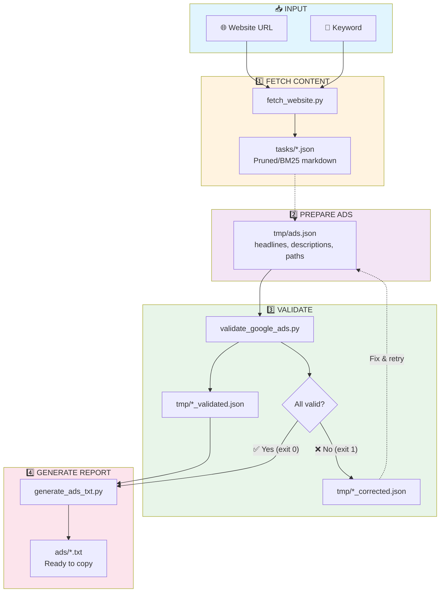

# CLAUDE.md

This file provides guidance to Claude Code (claude.ai/code) when working with code in this repository.

## Repository Overview

Python-based Google Ads text ad generator and validator system with automated workflows for creating compliant ads.

**Supported campaign types:**
- **RSA** (Responsive Search Ads) - standard text ads
- **PMAX** (Performance Max) - AI-powered multi-channel campaigns

## Commands

### Virtual Environment Activation
```bash
source venv/bin/activate
```

### Core Workflows

#### RSA (Responsive Search Ads)

**1. Validate RSA:**
```bash
python3 scripts/validate_google_ads.py [input_file]
# Default: tmp/ads.json
# Creates: [filename]_validated.json and [filename]_corrected.json
# Exit code: 0 on success, 1 on validation errors
```

**2. Generate RSA Report:**
```bash
python3 scripts/generate_ads_txt.py [validated_file] [-o output.txt] [-d output_dir] [-y]
# Default input: tmp/ads_validated.json
# Default output: ads/ads.txt
# -y flag: bypass validation warnings and force generation
```

#### PMAX (Performance Max)

**1. Validate PMAX:**
```bash
python3 scripts/validate_pmax.py [input_file]
# Default: tmp/pmax.json
# Creates: [filename]_validated.json and [filename]_corrected.json
# Special checks: min 1 headline ≤15 chars, long_headlines validation
# Exit code: 0 on success, 1 on validation errors
```

**2. Generate PMAX Report:**
```bash
python3 scripts/generate_pmax_txt.py [validated_file] [-o output.txt] [-d output_dir] [-y]
# Default input: tmp/pmax_validated.json
# Default output: ads/pmax.txt
```

#### Shared Tools

**3. Fetch Website Content:**
```bash
# Prune mode (default) - removes nav/footer/ads, keeps all content
python3 scripts/fetch_website.py <url>
python3 scripts/fetch_website.py <url> "keyword"  # keyword in filename

# BM25 mode - filters by keyword relevance (less content, more focused)
python3 scripts/fetch_website.py <url> "keyword" --mode bm25

# Output: tasks/domain.json or tasks/domain:keyword.json
```

**4. Check Text Length:**
```bash
python3 scripts/check_length.py "text1" "text2" ...
# Output: "text" - character_count (for each text)
# Supports: multiple texts, stdin input, special characters
# Use before validation or when fixing texts that exceeded limits
# Example: python3 scripts/check_length.py "Headline 1" "Headline 2"
```

**TOKEN-SAVING TIP**: When fixing texts that exceeded character limits:
1. Use `check_length.py` to verify each corrected text individually
2. Only run full validation after all texts pass individual checks
3. This saves tokens by avoiding repeated full validation runs

## Architecture

### Data Flow
1. **Input**: JSON file with ad content (`tmp/ads.json`)
2. **Validation**: Python validator checks character limits and element counts
3. **Correction**: Auto-generates suggestions for texts exceeding limits
4. **Output**: Human-readable `.txt` report in `ads/` directory

### Process Flow Diagram



### Key Components

- **GoogleAdsValidator** (scripts/validate_google_ads.py:12): RSA validation logic
- **PMaxValidator** (scripts/validate_pmax.py:12): PMAX validation logic with mobile headline check

### RSA Limits
- Headlines: 3-15 items, max 30 characters each
- Descriptions: 2-4 items, max 90 characters each
- URL Paths: exactly 2 items, max 15 characters each

### PMAX Limits
- Headlines: 3-15 items, max 30 chars, **min 1 must be ≤15 chars (mobile)**
- Long Headlines: 1-5 items, max 90 characters each
- Descriptions: 3-5 items, max 90 characters each
- URL Paths: exactly 2 items, max 15 characters each
- CTA: optional (from Google's list)

### RSA JSON Structure
```json
{
  "campaign_name": "optional",
  "product": "optional",
  "url": "optional",
  "headlines": ["required array, 3-15 items"],
  "descriptions": ["required array, 2-4 items"],
  "paths": ["exactly 2 items required"]
}
```

### PMAX JSON Structure
```json
{
  "campaign_name": "optional",
  "product": "optional",
  "url": "optional",
  "headlines": ["required, 3-15 items, min 1 ≤15 chars"],
  "long_headlines": ["required, 1-5 items, max 90 chars"],
  "descriptions": ["required, 3-5 items"],
  "paths": ["exactly 2 items"],
  "cta": "optional"
}
```

## Workflow Rules

When creating Google Ads:
1. Gather information interactively
2. Generate content following strict limits
3. Save to `tmp/ads.json`
4. Validate with Python script
5. Only present results after successful validation
6. Generate final `.txt` report

## Environment Requirements

- Python 3.13.5
- Virtual environment with dependencies from requirements.txt

### Installation
```bash
# Create and activate virtual environment
python3 -m venv venv
source venv/bin/activate

# Install dependencies
pip install -r requirements.txt

# Install browser for crawl4ai (first-time only)
playwright install chromium
```

## File Structure

```
/
├── scripts/                # Executable scripts
│   ├── validate_google_ads.py  # RSA validator
│   ├── generate_ads_txt.py     # RSA report generator
│   ├── validate_pmax.py        # PMAX validator
│   ├── generate_pmax_txt.py    # PMAX report generator
│   ├── fetch_website.py        # Website content fetcher
│   └── check_length.py         # Text length checker
├── tmp/                    # Temporary files (script inputs)
│   ├── ads.json           # RSA input data
│   ├── pmax_*.json        # PMAX input data
│   ├── *_validated.json   # Validation results
│   └── *_corrected.json   # Auto-generated corrections
├── ads/                    # Final text reports output directory
│   ├── *.txt              # RSA reports
│   └── pmax_*.txt         # PMAX reports
└── tasks/                  # Website fetch results (domain:keyword.json)
```