# CLAUDE.md

This file provides guidance to Claude Code (claude.ai/code) when working with code in this repository.

## Repository Overview

Python-based Google Ads text ad (RSA - Responsive Search Ads) generator and validator system with automated workflows for creating compliant ads.

## Commands

### Virtual Environment Activation
```bash
source venv/bin/activate
```

### Core Workflows

**1. Validate Google Ads:**
```bash
python3 scripts/validate_google_ads.py [input_file]
# Default: tmp/ads.json
# Creates: [filename]_validated.json and [filename]_corrected.json
# Exit code: 0 on success, 1 on validation errors
```

**2. Generate Text Report:**
```bash
python3 scripts/generate_ads_txt.py [validated_file] [-o output.txt] [-d output_dir] [-y]
# Default input: tmp/ads_validated.json
# Default output: ads/ads.txt
# -y flag: bypass validation warnings and force generation
```

**3. Fetch Website Content:**
```bash
# Prune mode (default) - removes nav/footer/ads, keeps all content
python3 scripts/fetch_website.py <url>
python3 scripts/fetch_website.py <url> "keyword"  # keyword in filename

# BM25 mode - filters by keyword relevance (less content, more focused)
python3 scripts/fetch_website.py <url> "keyword" --mode bm25

# Output: tasks/domain.json or tasks/domain:keyword.json
```

**4. Check Text Length:**
```bash
python3 scripts/check_length.py "text1" "text2" ...
# Output: "text" - character_count (for each text)
# Supports: multiple texts, stdin input, special characters
# Use before validation or when fixing texts that exceeded limits
# Example: python3 scripts/check_length.py "Headline 1" "Headline 2"
```

**TOKEN-SAVING TIP**: When fixing texts that exceeded character limits:
1. Use `check_length.py` to verify each corrected text individually
2. Only run full validation after all texts pass individual checks
3. This saves tokens by avoiding repeated full validation runs

## Architecture

### Data Flow
1. **Input**: JSON file with ad content (`tmp/ads.json`)
2. **Validation**: Python validator checks character limits and element counts
3. **Correction**: Auto-generates suggestions for texts exceeding limits
4. **Output**: Human-readable `.txt` report in `ads/` directory

### Process Flow Diagram

```mermaid
flowchart TD
    subgraph INPUT["📥 INPUT"]
        URL["🌐 Website URL"]
        KW["🔑 Keyword"]
    end

    subgraph FETCH["1️⃣ FETCH CONTENT"]
        F[fetch_website.py]
        TASK["tasks/*.json<br/>Pruned/BM25 markdown"]
    end

    subgraph PREPARE["2️⃣ PREPARE ADS"]
        ADS["tmp/ads.json<br/>headlines, descriptions, paths"]
    end

    subgraph VALIDATE["3️⃣ VALIDATE"]
        V[validate_google_ads.py]
        CHECK{"All valid?"}
        VAL["tmp/*_validated.json"]
        CORR["tmp/*_corrected.json"]
    end

    subgraph GENERATE["4️⃣ GENERATE REPORT"]
        G[generate_ads_txt.py]
        TXT["ads/*.txt<br/>Ready to copy"]
    end

    URL --> F
    KW --> F
    F --> TASK
    TASK -.-> ADS
    ADS --> V
    V --> VAL
    V --> CHECK
    CHECK -->|"✅ Yes (exit 0)"| G
    CHECK -->|"❌ No (exit 1)"| CORR
    CORR -.->|"Fix & retry"| ADS
    VAL --> G
    G --> TXT

    style INPUT fill:#e1f5fe
    style FETCH fill:#fff3e0
    style PREPARE fill:#f3e5f5
    style VALIDATE fill:#e8f5e9
    style GENERATE fill:#fce4ec
```



### Key Components

- **GoogleAdsValidator** (scripts/validate_google_ads.py:12): Core validation logic with strict Google Ads requirements
- **Google Ads Limits**:
  - Headlines: 3-15 items, max 30 characters each
  - Descriptions: 2-4 items, max 90 characters each
  - URL Paths: exactly 2 items, max 15 characters each

### JSON Structure
```json
{
  "campaign_name": "optional",
  "product": "optional",
  "url": "optional",
  "headlines": ["required array, 3-15 items"],
  "descriptions": ["required array, 2-4 items"],
  "paths": ["exactly 2 items required"]
}
```

## Workflow Rules

When creating Google Ads:
1. Gather information interactively
2. Generate content following strict limits
3. Save to `tmp/ads.json`
4. Validate with Python script
5. Only present results after successful validation
6. Generate final `.txt` report

## Environment Requirements

- Python 3.13.5
- Virtual environment with dependencies from requirements.txt

### Installation
```bash
# Create and activate virtual environment
python3 -m venv venv
source venv/bin/activate

# Install dependencies
pip install -r requirements.txt

# Install browser for crawl4ai (first-time only)
playwright install chromium
```

## File Structure

```
/
├── scripts/                # Executable scripts
│   ├── validate_google_ads.py  # Validates ad JSON against Google Ads requirements
│   ├── generate_ads_txt.py     # Converts validated JSON to readable .txt report
│   ├── fetch_website.py        # Fetches website content using local crawl4ai
│   └── check_length.py         # Simple text length checker for quick validation
├── tmp/                    # Temporary files (script inputs)
│   ├── ads.json           # Raw ad data input
│   ├── *_validated.json   # Validation results
│   └── *_corrected.json   # Auto-generated corrections
├── ads/                    # Final text reports output directory
└── tasks/                  # Website fetch results (domain:keyword.json)
```