# Google Ads Text Ad Generator

This repository contains Python scripts for automatic generation and validation of Google Ads text ads with website content fetching capabilities.

**Supported campaign types:**
- **RSA** (Responsive Search Ads) - standard text ads
- **PMAX** (Performance Max) - AI-powered multi-channel campaigns

## File Structure

```
/
├── scripts/                # Executable scripts
│   ├── validate_google_ads.py  # RSA validator
│   ├── generate_ads_txt.py     # RSA text file generator
│   ├── validate_pmax.py        # PMAX validator
│   ├── generate_pmax_txt.py    # PMAX text file generator
│   ├── fetch_website.py        # Website content fetcher (local crawl4ai)
│   └── check_length.py         # Text length checker
├── n8n-agent/              # AI Agent for n8n workflow
│   ├── system-prompt-interactive.md  # System prompt with copywriting frameworks
│   ├── n8n-agent-plan.md   # Architecture documentation
│   ├── validate_google_ads.js  # Validation tool (JS)
│   ├── check_text_length.js    # Length checker tool (JS)
│   └── n8n-workflows/      # Exportable workflow JSON
├── tmp/                    # Temporary files (script inputs)
│   ├── ads.json           # RSA input data
│   ├── pmax_*.json        # PMAX input data
│   ├── *_validated.json   # Validation results
│   └── *_corrected.json   # Suggested corrections
├── ads/                    # Ready text reports
│   └── *.txt              # Files to copy to Google Ads
├── tasks/                  # Website fetch results
│   └── *.json             # Fetched content (domain:keyword.json)
└── venv/                   # Python virtual environment
```

## RSA Workflow

### RSA (Responsive Search Ads)

1.  **Prepare data**: Place an `ads.json` file with ad data in the `tmp/` directory. The file should have the following structure:

    ```json
    {
      "campaign_name": "Campaign Name (optional)",
      "product": "Product/Service (optional)",
      "url": "https://example.com (optional)",
      "headlines": [
        "Headline 1",
        "Headline 2",
        "..."
      ],
      "descriptions": [
        "Description 1",
        "Description 2",
        "..."
      ],
      "paths": [
        "path1",
        "path2"
      ]
    }
    ```
    Fields `headlines`, `descriptions`, and `paths` are required.

2.  **Validate ad**: Run the validation script.
    ```bash
    python3 scripts/validate_google_ads.py
    ```
    The script will check character limits and element counts, then create `tmp/validated_ad.json`. If validation fails, the script will exit with error code 1.

3.  **Generate `.txt` report**: After successful validation, run the report generator.
    ```bash
    python3 scripts/generate_ads_txt.py
    ```
    The script will read `tmp/validated_ad.json` and create a readable text file in the `ads/` directory.

### PMAX (Performance Max)

1.  **Prepare data**: Place a `pmax_[name].json` file with PMAX assets in the `tmp/` directory:

    ```json
    {
      "campaign_name": "Campaign Name (optional)",
      "product": "Product/Service (optional)",
      "url": "https://example.com (optional)",
      "headlines": [
        "Headline 1 (max 30 chars)",
        "...",
        "Short One (≤15 chars for mobile - REQUIRED)"
      ],
      "long_headlines": [
        "Long Headline 1 (max 90 chars)",
        "..."
      ],
      "descriptions": [
        "Description 1 (max 90 chars)",
        "..."
      ],
      "paths": [
        "path1",
        "path2"
      ],
      "cta": "Shop now (optional)"
    }
    ```
    **Required**: `headlines` (3-15, min 1 ≤15 chars), `long_headlines` (1-5), `descriptions` (3-5), `paths` (exactly 2)

2.  **Validate ad**: Run the PMAX validation script.
    ```bash
    python3 scripts/validate_pmax.py tmp/pmax_campaign.json
    ```

3.  **Generate `.txt` report**: After successful validation.
    ```bash
    python3 scripts/generate_pmax_txt.py tmp/pmax_campaign_validated.json
    ```

## Scripts and Arguments

### `scripts/validate_google_ads.py`

Validates specified JSON file or defaults to `tmp/ads.json`.

-   **Arguments**:
    -   `input_file` (optional): Path to input `.json` file. Default: `tmp/ads.json`.
-   **Output**: Creates in the same directory as input file:
    -   `[filename]_validated.json`: Full validation report.
    -   `[filename]_corrected.json`: Suggested corrections (if errors occurred).
-   **Behavior**: Exits with code `0` on successful validation or `1` on errors.

### `scripts/generate_ads_txt.py`

Script generates final `.txt` file based on validated RSA data.

-   **Arguments**:
    -   `input_file` (optional): Path to validated `_validated.json` file. Default: `tmp/ads_validated.json`.
    -   `-o`, `--output`: Specifies output filename. Default: `ads.txt`.
    -   `-d`, `--dir`: Specifies target directory. Default: `ads`.
    -   `-y`, `--yes`: Automatically approves file generation even if validation in `.json` file was not fully successful.

### `scripts/validate_pmax.py`

Validates Performance Max JSON file or defaults to `tmp/pmax.json`.

-   **Arguments**:
    -   `input_file` (optional): Path to input `.json` file. Default: `tmp/pmax.json`.
-   **Output**: Creates in the same directory as input file:
    -   `[filename]_validated.json`: Full validation report.
    -   `[filename]_corrected.json`: Suggested corrections (if errors occurred).
-   **Special validations**:
    -   Checks for at least 1 headline ≤15 characters (mobile requirement)
    -   Validates Long Headlines (1-5 items, max 90 chars)
    -   Validates Descriptions (3-5 items, max 90 chars)
-   **Behavior**: Exits with code `0` on successful validation or `1` on errors.

### `scripts/generate_pmax_txt.py`

Script generates final `.txt` file based on validated PMAX data.

-   **Arguments**:
    -   `input_file` (optional): Path to validated `_validated.json` file. Default: `tmp/pmax_validated.json`.
    -   `-o`, `--output`: Specifies output filename. Default: `pmax.txt`.
    -   `-d`, `--dir`: Specifies target directory. Default: `ads`.
    -   `-y`, `--yes`: Automatically approves file generation.
-   **Output sections**: Headlines (with mobile indicator), Long Headlines, Descriptions, Paths, CTA

### `scripts/fetch_website.py`

Fetches website content using local crawl4ai library with two filter modes.

-   **Arguments**:
    -   `url`: URL address of page to fetch
    -   `q` (optional): Keyword - optional for prune mode, required for bm25 mode
    -   `--mode`: Filter mode: `prune` (default) or `bm25`
-   **Modes**:
    -   **prune** (default): Removes boilerplate (nav, footer, ads) but keeps all content (shipping, warranty, etc.)
    -   **bm25**: Filters content by keyword relevance - more focused but may miss context
-   **Output**: Creates JSON file in `tasks/` directory:
    -   With keyword: `domain:keyword.json`
    -   Without keyword: `domain.json`
-   **Example usage**:
    ```bash
    # Prune mode (default) - removes junk, keeps all content
    python3 scripts/fetch_website.py https://example.com

    # Prune mode with keyword in filename
    python3 scripts/fetch_website.py https://example.com "keyword"

    # BM25 mode - filters by keyword relevance
    python3 scripts/fetch_website.py https://example.com "keyword" --mode bm25
    ```

### `scripts/check_length.py`

Returns character count for each input text. Supports bulk mode and special characters.

-   **Arguments**:
    -   `text(s)`: One or more texts to check (in quotes)
-   **Input methods**:
    -   Command line arguments (one or more texts)
    -   Stdin (one text per line)
-   **Output**: `"text" - character_count` for each text
-   **When to use**:
    -   Before full validation - to check texts while writing
    -   After validation errors - to verify corrected texts
-   **Examples**:
    ```bash
    # Single text
    python3 scripts/check_length.py "My Headline"
    # Output: "My Headline" - 11

    # Multiple texts (bulk mode)
    python3 scripts/check_length.py "First headline" "Second one" "Third"
    # Output:
    # "First headline" - 14
    # "Second one" - 10
    # "Third" - 5

    # From stdin
    echo -e "Text one\nText two" | python3 scripts/check_length.py

    # Handles special characters
    python3 scripts/check_length.py "It's a \"test\"" "@#$%^&*()"
    ```

## Usage Examples

### Complete workflow with page analysis

```bash
# 1. Activate virtual environment
source venv/bin/activate

# 2. Fetch page content for analysis (optional)
python3 scripts/fetch_website.py https://example.com "main keyword"

# 3. Prepare ads.json file with ad data in tmp/ directory

# 4. Validate ad
python3 scripts/validate_google_ads.py

# 5. Generate final report (only after successful validation)
python3 scripts/generate_ads_txt.py
```

### Real-time text length checking

```bash
# Check single text while writing
python3 scripts/check_length.py "My ad headline"

# Check multiple texts at once
python3 scripts/check_length.py "Headline 1" "Headline 2" "Description text"
```

### Working with custom files

```bash
# Validate specific file
python3 scripts/validate_google_ads.py tmp/special_campaign.json

# Generate report with custom name
python3 scripts/generate_ads_txt.py tmp/special_campaign_validated.json \
  --output special_campaign.txt --dir reports/
```

### Force generation on errors

```bash
# If you want to generate report despite validation errors
python3 scripts/generate_ads_txt.py -y
```

## Process Flow Diagram

```mermaid
flowchart TD
    subgraph INPUT["📥 INPUT"]
        URL["🌐 Website URL"]
        KW["🔑 Keyword"]
    end

    subgraph FETCH["1️⃣ FETCH CONTENT"]
        F[fetch_website.py]
        TASK["tasks/*.json<br/>Pruned/BM25 markdown"]
    end

    subgraph PREPARE["2️⃣ PREPARE ADS"]
        ADS["tmp/ads.json<br/>headlines, descriptions, paths"]
    end

    subgraph VALIDATE["3️⃣ VALIDATE"]
        V[validate_google_ads.py]
        CHECK{"All valid?"}
        VAL["tmp/*_validated.json"]
        CORR["tmp/*_corrected.json"]
    end

    subgraph GENERATE["4️⃣ GENERATE REPORT"]
        G[generate_ads_txt.py]
        TXT["ads/*.txt<br/>Ready to copy"]
    end

    URL --> F
    KW --> F
    F --> TASK
    TASK -.-> ADS
    ADS --> V
    V --> VAL
    V --> CHECK
    CHECK -->|"✅ Yes (exit 0)"| G
    CHECK -->|"❌ No (exit 1)"| CORR
    CORR -.->|"Fix & retry"| ADS
    VAL --> G
    G --> TXT

    style INPUT fill:#e1f5fe
    style FETCH fill:#fff3e0
    style PREPARE fill:#f3e5f5
    style VALIDATE fill:#e8f5e9
    style GENERATE fill:#fce4ec
```



## n8n AI Agent

The `n8n-agent/` directory contains an automated AI agent workflow for n8n that generates Google Ads from website content.

### Features
- **Automated workflow**: Chat interface for URL input, automatic ad generation
- **AI-powered**: Uses Gemini 2.5 Flash via OpenRouter
- **Copywriting frameworks**: 4U, PAS, BAB, FAB formulas built into the prompt
- **Validation loop**: Automatically validates and fixes ads until they pass
- **Silent mode**: Fixes validation errors without user interaction

### Files
```
n8n-agent/
├── rsa-system-prompt-interactive.md  # Full system prompt with copywriting frameworks
├── rsa-system-prompt.md              # Simplified system prompt
├── n8n-agent-plan.md                 # Architecture and implementation plan
├── validate_google_ads.js            # Validation tool code
├── check_text_length.js              # Length checker tool code
└── n8n-workflows/
    ├── google-ads-rsa-creation-agent.json  # Main RSA agent workflow
    └── _tool web scraper.json              # Web scraper sub-workflow
```

### Tools Available to Agent
- `scrape_website` - Fetches website content
- `validate_google_ads` - Validates ads against Google requirements
- `check_text_length` - Character count checker
- `think` - Internal reasoning (no output)

See [n8n-agent/n8n-agent-plan.md](n8n-agent/n8n-agent-plan.md) for full documentation.

### Google Ads Validation Rules

| Check | Requirement |
|-------|-------------|
| Headlines count | 3-15 items |
| Headlines length | ≤30 characters each |
| Descriptions count | 2-4 items |
| Descriptions length | ≤90 characters each |
| Paths count | Exactly 2 |
| Paths length | ≤15 characters each |

## Requirements

- **Python 3.13.5**
- **Virtual environment** with packages: `crawl4ai`, `python-dotenv`

## Installation

```bash
# Clone repository
git clone https://github.com/romek-rozen/google-ads-generator-with-ai-assistants.git
cd google-ads-generator-with-ai-assistants

# Create virtual environment
python3 -m venv venv
source venv/bin/activate

# Install dependencies
pip install -r requirements.txt

# Install browser for crawl4ai (first-time only)
playwright install chromium
```

## Google Ads Limits

### RSA (Responsive Search Ads)

| Element | Limit | Required Count |
|---------|-------|----------------|
| Headlines | 30 characters | 3-15 items |
| Descriptions | 90 characters | 2-4 items |
| URL Paths | 15 characters | Exactly 2 |

### PMAX (Performance Max)

| Element | Limit | Required Count | Notes |
|---------|-------|----------------|-------|
| Headlines | 30 characters | 3-15 items | **Min 1 must be ≤15 chars** |
| Long Headlines | 90 characters | 1-5 items | Used in larger placements |
| Descriptions | 90 characters | 3-5 items | More than RSA |
| URL Paths | 15 characters | Exactly 2 | Same as RSA |
| CTA | From list | 1 item | Optional |

## License

MIT License - see [LICENSE](LICENSE) for details.

**Author:** [Roman Rozenberger](https://rozenberger.com/)